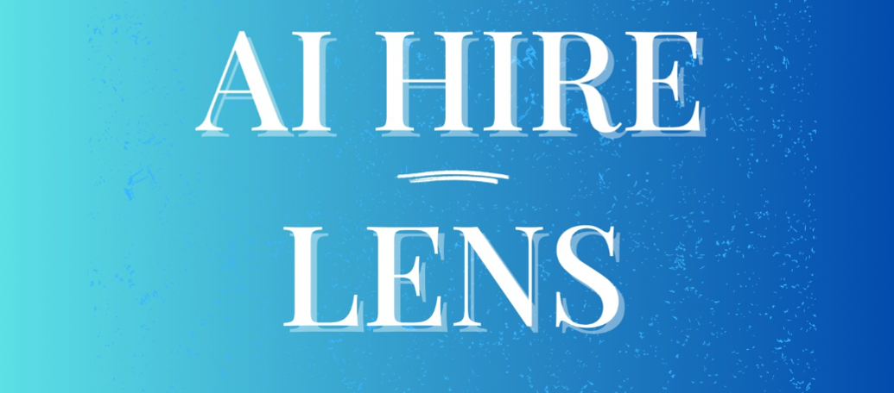

# 🧠 AI Resume Analyzer with Recommendations


A web-based AI-powered tool that uses Natural Language Processing (NLP) to **analyze resumes**, extract key information, **predict job roles**, **score resume quality**, and provide **recommendations** for skills, courses, and improvements. Designed for both **applicants** and **recruiters**, with an **admin dashboard** for managing analytics and feedback.

---

## 🚀 Demo


> _Upload your resume → Get tips, predictions, scores, and more!_
---

## 🔧 Tech Stack

| Layer       | Technologies                               |
|-------------|--------------------------------------------|
| Frontend    | Streamlit, HTML5, CSS3, JavaScript         |
| Backend     | Python, NLP (custom logic), PDFMiner       |
| Database    | MySQL                                      |
| Visualization | Plotly, Pandas                          |

---

## ✨ Features

- 📄 **Resume Parsing**: Extracts name, email, experience, education, and skills from PDFs  
- 🔍 **Job Role Prediction**: Suggests relevant roles based on skillset  
- 🧠 **Skill Recommendations**: Highlights missing or in-demand skills  
- 📊 **Resume Scoring**: Scores resumes and suggests improvements  
- 📈 **Admin Dashboard**: View user analytics, ratings, feedback  
- 📥 **CSV Export**: Download structured resume data  
- 💬 **User Feedback**: Collect and analyze user reviews

---

## 📊 Project Metrics

- ✅ 100+ resumes parsed
- ⚡ < 3 seconds average parsing time
- 🎯 ~85% prediction accuracy
- 📈 6+ interactive analytics charts
- 💬 30+ user feedback entries

---

## 🛠️ Setup Instructions

### Create a virtual environment & activate it

```bash
python -m venv venv
source venv/bin/activate  # On Windows: venv\Scripts\activate
```

### Install required packages

```bash
pip install -r requirements.txt
```

### Run the app

```bash
streamlit run app.py
```

---

## 📁 Folder Structure

```
📦AI-Resume-Analyzer
 ┣ 📁static
 ┣ 📁utils
 ┣ 📄app.py
 ┣ 📄requirements.txt
 ┣ 📄Courses.py
 ┣ 📄README.md
```

---

## 📌 To Do / Future Scope

- Add support for DOCX resumes  
- Improve experience level prediction using ML  
- Resume ranking for job-specific roles  
- Integrate with real-time job APIs  

---

## 🧑‍💻 Author

- **Hariharan S** – [LinkedIn](https://linkedin.com/in/hariharan-subburaj)
- Guided by **Dr. Ranjith**
- Government colleng of engineering srirangam.

---

## 📄 License

This project is licensed under the MIT License.

---

## 🙌 Acknowledgements

- [Streamlit Docs](https://docs.streamlit.io/)  
- Udemy Data Science Bootcamp  
- IJITEE & Academia NLP research  
- Resume parsing blogs and [RChilli](https://www.rchilli.com/blog/resume-parsing-101/) NLP guide
